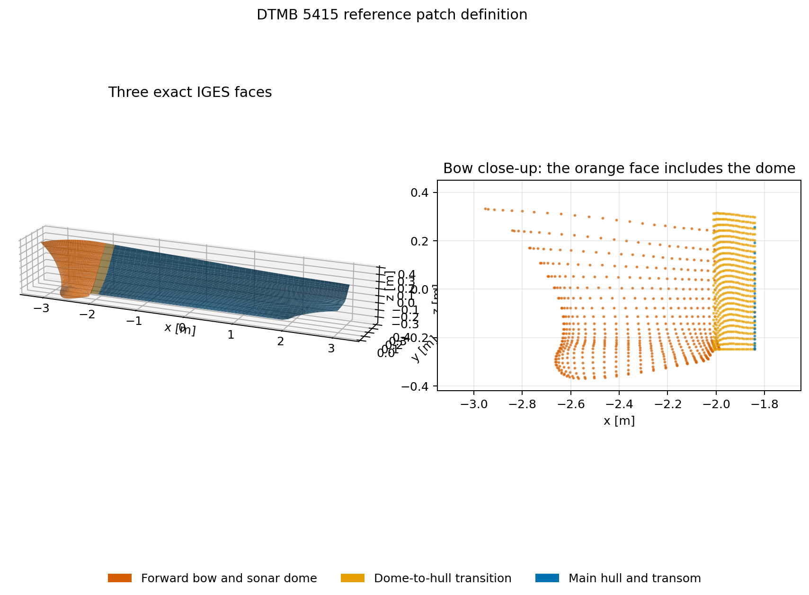
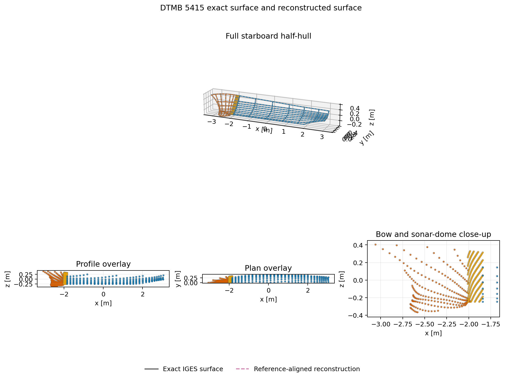
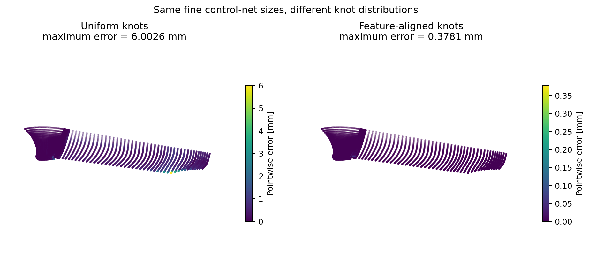
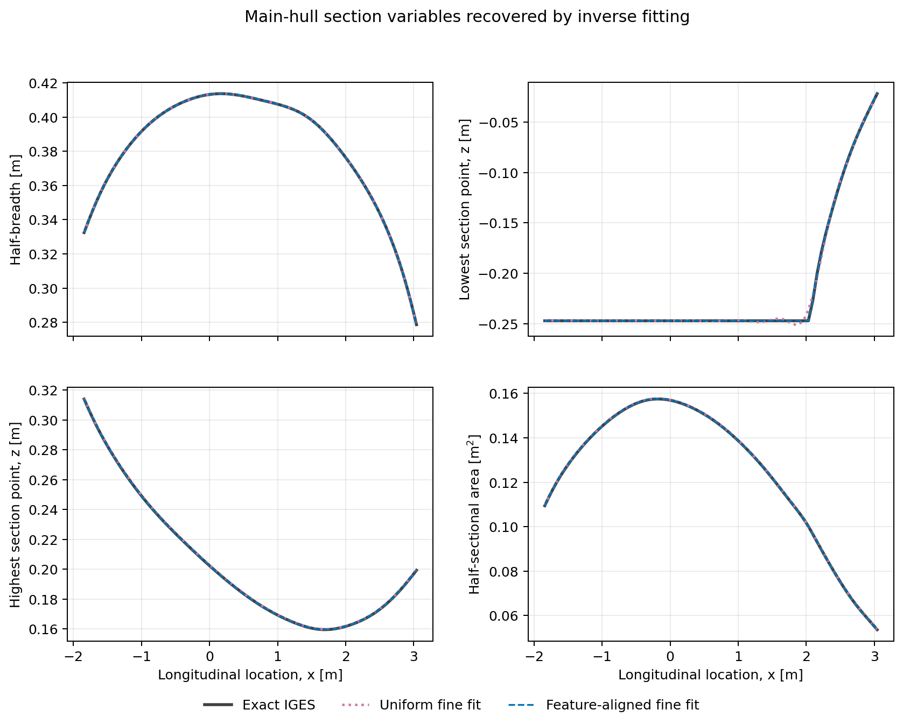
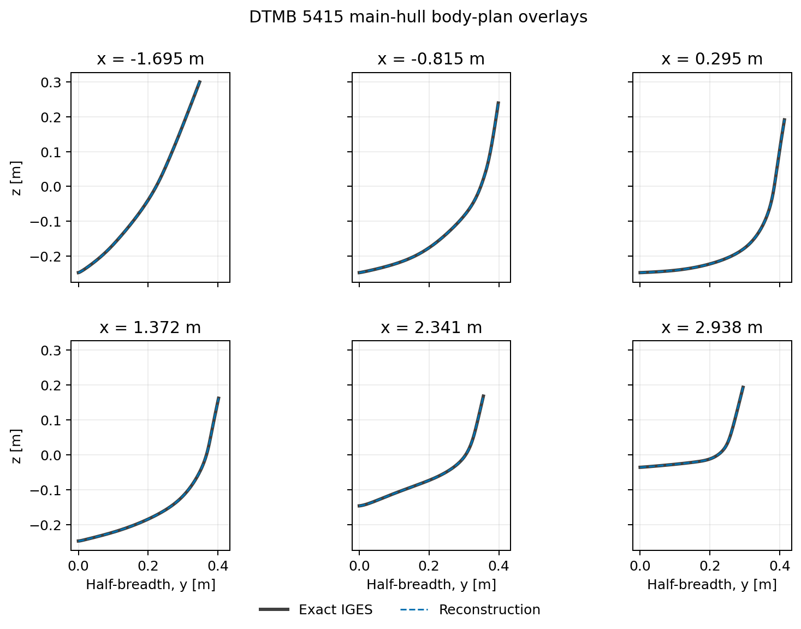

# DTMB 5415 validation

DTMB 5415 is the first published-hull validation target. The benchmark is
particularly useful because a credible representation must retain its sonar
dome, the short dome-to-hull transition, and the transom termination. A single
globally smooth hull patch would erase exactly the local geometry that makes
this case valuable.

## Reference geometry

The validation uses the Gothenburg DTMB 5415 IGES distributed by the mathLab
`WaveBEMapp-DTMB-5415` project under the MIT license. The source is pinned to
commit `afad0f04a2ce5ee03f37dcefbe697a5281bc0168` and checked against SHA-256
`a3d1e9d82ff5aec16525f39e1708af4bd71960c56e9584d494554633e60dc8ad`.

- [SIMMAN 2008 DTMB 5415 description](https://www.simman2008.dk/5415/combatant.html)
- [Pinned IGES source](https://raw.githubusercontent.com/mathLab/WaveBEMapp-DTMB-5415/afad0f04a2ce5ee03f37dcefbe697a5281bc0168/goteborg_original.iges)
- [Source repository and MIT license](https://github.com/mathLab/WaveBEMapp-DTMB-5415)

The file contains three starboard-half polynomial B-spline faces with unit
weights:

| Region | Reference degree | Reference control net | Role |
|---|---:|---:|---|
| Forward bow and sonar dome | $(3,3)$ | $19\times14$ | Entire forward face, including the sonar dome and upper bow |
| Dome transition | $(3,5)$ | $4\times81$ | Dedicated connection to the hull |
| Main hull | $(3,3)$ | $16\times10$ | Remaining hull through the transom edge |

The reader deliberately accepts only IGES entity 128 with all weights equal to
one. It maps the active rectangular parameter bounds into $[0,1]^2$ and rejects
rational surfaces. This keeps the validation aligned with the current
non-rational scope of `ship_geo`.

The sampled reference extents are $6.11910\ \mathrm{m}$ overall length,
$0.82738\ \mathrm{m}$ beam, and $0.36883\ \mathrm{m}$ below $z=0$. The overall
length includes the sonar dome and must not be interpreted as $L_{PP}$.

## Approximation study

Each reference face is sampled at fixed parametric coordinates and independently
approximated by a polynomial B-spline patch. This inverse fit is a validation
operation, not the primary hull-generation method. The fitting map and fitted
coefficients remain in the CSDL graph.

The earlier validation figure superimposed black lines joining fitted control
points. Those lines were the **control net**, not a reconstructed hull surface.
They also obscured the exact surface and made the main hull look like an
unexplained gray patch. The revised figures never use a control net as evidence
of surface agreement. They compare evaluations of the exact IGES surface and
the reconstructed B-spline surface at identical parameters.

The pointwise errors are

$$
e_j=\left\|\mathbf S_h(u_j,v_j)-\mathbf S_{\mathrm{ref}}(u_j,v_j)\right\|_2,
$$

with

$$
e_{\mathrm{RMS}}=
\sqrt{\frac{1}{N}\sum_{j=1}^{N}e_j^2},
\qquad
e_{\max}=\max_j e_j.
$$

The sonar-dome error is always reported separately.

| Level | Global RMS [mm] | Global max [mm] | Dome RMS [mm] | Dome max [mm] |
|---|---:|---:|---:|---:|
| Coarse | 8.3161 | 39.9995 | 8.4277 | 39.9995 |
| Medium | 2.4229 | 21.2251 | 2.9437 | 12.9237 |
| Fine | 0.3499 | 6.0026 | 0.2332 | 1.5447 |

The fine global RMS error is $5.72\times10^{-5}$ of the reference overall
length. The main-hull maximum remains larger than its RMS because it is a
pointwise boundary error; regional RMS and maximum values are both retained in
the API so refinement can target such localized behavior.

## What the three reference regions mean

The orange region is not only the protruding lower dome. It is the complete
forward IGES face and contains both the upper bow and sonar dome. The narrow
gold region is the highly resolved transition face, and the blue region is the
main hull extending to the transom.



## Surface-on-surface comparison

The exact surface is shown with gray lines and open markers. The reconstructed
surface is evaluated at the same parameters and shown with colored dashed lines
and points. The four views include the full starboard half-hull, profile, plan,
and a close-up of the sonar-dome region. Coincident marks indicate agreement;
there is no opaque patch hiding either surface.



## Fitting the representation along the hull

A uniform knot vector allocates spline freedom uniformly in parameter space,
even though DTMB 5415 has tightly clustered bow, dome, and transom features.
Increasing only the number of control points therefore leaves a localized
$6.0026\ \mathrm{mm}$ maximum error in the fine fit.

The new `reference_aligned` strategy treats the knot locations and continuity
as representation variables. It maps source feature locations into $[0,1]^2$,
retains the source continuity when the target degree permits it, and samples
every resulting knot span during fitting. The fine control-net sizes are held
fixed in this comparison, so the improvement is caused by the representation
distribution rather than by adding coefficients.

| Fine-fit strategy | Global RMS [mm] | Global max [mm] | Forward face RMS [mm] | Transition RMS [mm] | Main hull RMS [mm] |
|---|---:|---:|---:|---:|---:|
| Uniform knots | 0.349888 | 6.002567 | 0.233244 | 0.024369 | 0.558809 |
| Feature-aligned knots | 0.011579 | 0.378122 | $<10^{-8}$ | 0.020055 | $<10^{-8}$ |

The forward face and main hull reproduce to numerical precision because their
fine target spaces can contain the source spaces after feature alignment. The
transition remains approximate because its source is degree five with an
$4\times81$ control net, while the fine target is degree three with only
$4\times28$ coefficients. This remaining error is therefore expected and is
localized to the deliberately reduced transition representation.



The inverse-fit audit also compares longitudinal distributions that are closer
to hull-design variables: maximum half-breadth, lowest and highest section
points, and half-sectional area. This does not yet infer the eventual
first-principles F-Spline design variables. It verifies that the fitted surface
recovers the geometric distributions those variables must control.



Selected body-plan sections provide a direct section-by-section comparison.



Run the complete study with

```bash
python examples/dtmb_5415_validation.py
```

The script downloads the pinned file only when `--source` is not supplied,
verifies the digest, prints all convergence results, and writes all five
figures. When `--output path/name.png` is supplied, the four comparison figures
are written beside it with descriptive suffixes.
