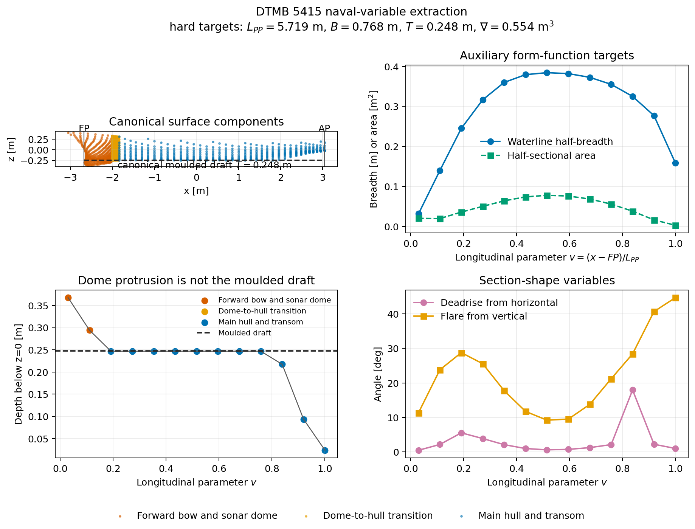
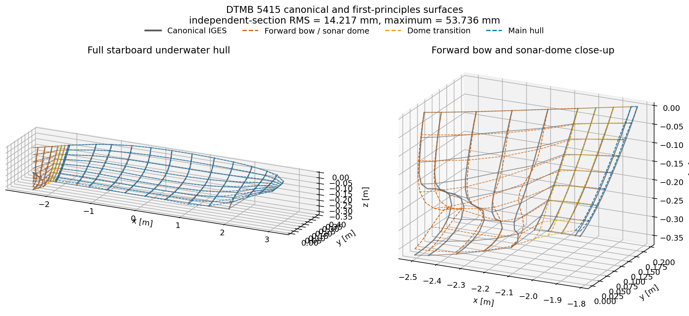
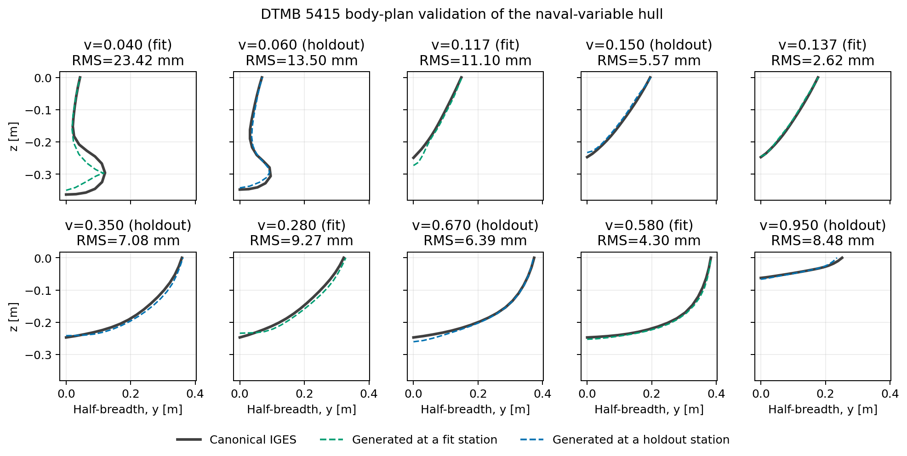
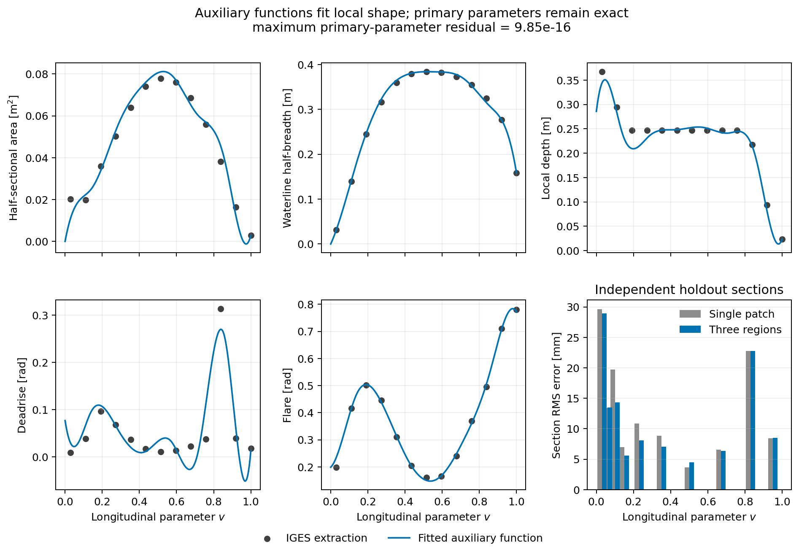

# DTMB 5415 validation

DTMB 5415 is the first published-hull validation target. The benchmark is
particularly useful because a credible representation must retain its sonar
dome, the short dome-to-hull transition, and the transom termination. A single
globally smooth hull patch would erase exactly the local geometry that makes
this case valuable.

## Reference geometry

The validation uses the Gothenburg DTMB 5415 IGES distributed by the mathLab
`WaveBEMapp-DTMB-5415` project under the MIT license. The source is pinned to
commit `afad0f04a2ce5ee03f37dcefbe697a5281bc0168` and checked against SHA-256
`a3d1e9d82ff5aec16525f39e1708af4bd71960c56e9584d494554633e60dc8ad`.

- [SIMMAN 2008 DTMB 5415 description](https://www.simman2008.dk/5415/combatant.html)
- [Pinned IGES source](https://raw.githubusercontent.com/mathLab/WaveBEMapp-DTMB-5415/afad0f04a2ce5ee03f37dcefbe697a5281bc0168/goteborg_original.iges)
- [Source repository and MIT license](https://github.com/mathLab/WaveBEMapp-DTMB-5415)

The file contains three starboard-half polynomial B-spline faces with unit
weights:

| Region | Reference degree | Reference control net | Role |
|---|---:|---:|---|
| Forward bow and sonar dome | $(3,3)$ | $19\times14$ | Entire forward face, including the sonar dome and upper bow |
| Dome transition | $(3,5)$ | $4\times81$ | Dedicated connection to the hull |
| Main hull | $(3,3)$ | $16\times10$ | Remaining hull through the transom edge |

The reader deliberately accepts only IGES entity 128 with all weights equal to
one. It maps the active rectangular parameter bounds into $[0,1]^2$ and rejects
rational surfaces. This keeps the validation aligned with the current
non-rational scope of `ship_geo`.

The sampled reference extents are $6.11910\ \mathrm{m}$ overall length,
$0.82738\ \mathrm{m}$ beam, and $0.36883\ \mathrm{m}$ below $z=0$. The overall
length includes the sonar dome and must not be interpreted as $L_{PP}$.

## Approximation study

Each reference face is sampled at fixed parametric coordinates and independently
approximated by a polynomial B-spline patch. This inverse fit is a validation
operation, not the primary hull-generation method. The fitting map and fitted
coefficients remain in the CSDL graph.

The earlier validation figure superimposed black lines joining fitted control
points. Those lines were the **control net**, not a reconstructed hull surface.
They also obscured the exact surface and made the main hull look like an
unexplained gray patch. The revised figures never use a control net as evidence
of surface agreement. They compare evaluations of the exact IGES surface and
the reconstructed B-spline surface at identical parameters.

The pointwise errors are

$$
e_j=\left\|\mathbf S_h(u_j,v_j)-\mathbf S_{\mathrm{ref}}(u_j,v_j)\right\|_2,
$$

with

$$
e_{\mathrm{RMS}}=
\sqrt{\frac{1}{N}\sum_{j=1}^{N}e_j^2},
\qquad
e_{\max}=\max_j e_j.
$$

The sonar-dome error is always reported separately.

| Level | Global RMS [mm] | Global max [mm] | Dome RMS [mm] | Dome max [mm] |
|---|---:|---:|---:|---:|
| Coarse | 8.3161 | 39.9995 | 8.4277 | 39.9995 |
| Medium | 2.4229 | 21.2251 | 2.9437 | 12.9237 |
| Fine | 0.3499 | 6.0026 | 0.2332 | 1.5447 |

The fine global RMS error is $5.72\times10^{-5}$ of the reference overall
length. The main-hull maximum remains larger than its RMS because it is a
pointwise boundary error; regional RMS and maximum values are both retained in
the API so refinement can target such localized behavior.

## What the three reference regions mean

The orange region is not only the protruding lower dome. It is the complete
forward IGES face and contains both the upper bow and sonar dome. The narrow
gold region is the highly resolved transition face, and the blue region is the
main hull extending to the transom.


## Surface-on-surface comparison

The exact surface is shown with gray lines and open markers. The reconstructed
surface is evaluated at the same parameters and shown with colored dashed lines
and points. The four views include the full starboard half-hull, profile, plan,
and a close-up of the sonar-dome region. Coincident marks indicate agreement;
there is no opaque patch hiding either surface.


## Fitting the representation along the hull

A uniform knot vector allocates spline freedom uniformly in parameter space,
even though DTMB 5415 has tightly clustered bow, dome, and transom features.
Increasing only the number of control points therefore leaves a localized
$6.0026\ \mathrm{mm}$ maximum error in the fine fit.

The new `reference_aligned` strategy treats the knot locations and continuity
as representation variables. It maps source feature locations into $[0,1]^2$,
retains the source continuity when the target degree permits it, and samples
every resulting knot span during fitting. The fine control-net sizes are held
fixed in this comparison, so the improvement is caused by the representation
distribution rather than by adding coefficients.

| Fine-fit strategy | Global RMS [mm] | Global max [mm] | Forward face RMS [mm] | Transition RMS [mm] | Main hull RMS [mm] |
|---|---:|---:|---:|---:|---:|
| Uniform knots | 0.349888 | 6.002567 | 0.233244 | 0.024369 | 0.558809 |
| Feature-aligned knots | 0.011579 | 0.378122 | $<10^{-8}$ | 0.020055 | $<10^{-8}$ |

The forward face and main hull reproduce to numerical precision because their
fine target spaces can contain the source spaces after feature alignment. The
transition remains approximate because its source is degree five with an
$4\times81$ control net, while the fine target is degree three with only
$4\times28$ coefficients. This remaining error is therefore expected and is
localized to the deliberately reduced transition representation.


The inverse-fit audit also compares longitudinal distributions that are closer
to hull-design variables: maximum half-breadth, lowest and highest section
points, and half-sectional area. This does not yet infer the eventual
first-principles F-Spline design variables. It verifies that the fitted surface
recovers the geometric distributions those variables must control.


Selected body-plan sections provide a direct section-by-section comparison.


## Naval-variable extraction

The next layer converts the canonical surface into the form-parameter hierarchy
used by the first-principles generator. The primary variables are not inferred
by unconstrained surface fitting. Published model particulars are retained as
hard targets:

$$
L_{PP}=5.719\ \mathrm{m},\qquad
B=0.768\ \mathrm{m},\qquad
T=0.248\ \mathrm{m},\qquad
\nabla=0.554\ \mathrm{m^3}.
$$

Constant-$x$ sections of the exact IGES surfaces supply auxiliary observations
for the waterline half-breadth, half-sectional area, local draft, deadrise, and
flare functions. These observations give the inverse fit local freedom without
allowing the important naval particulars to drift.

The sonar dome requires a deliberate distinction. Its deepest point is
$0.36876\ \mathrm{m}$ below $z=0$, approximately $0.12076\ \mathrm{m}$ below
the canonical moulded draft. That protrusion is an auxiliary observation on the
forward component; it is **not** used as the ship draft. The primary draft
constraint is located from the main-hull face, whose extracted value is
$0.24699\ \mathrm{m}$ at the available surface resolution.



The five longitudinal curves and all transverse section states are assembled
into one `VariationalSystem` and one CSDL Newton solve. The current stable
formulation enforces $B$, $T$, $\nabla$, LCB, and $C_{WP}$ exactly on the curves
of form, while the sampled functions enter as scaled least-squares objectives.
Final-surface hydrostatic equality constraints will be added only with a
globalized nonlinear solve; undamped Newton was not robust enough for that
additional coupling.

## Naval-variable surface calibration

The first-principles calibration follows a two-level hierarchy. The primary
naval variables remain exact construction constraints, while auxiliary
functions select one locally useful surface from the admissible family.

| Role | Variables | Treatment |
|---|---|---|
| Primary design variables | $L_{PP}$, $B$, $T$, $\nabla$, LCB, $C_{WP}$ | Exact equality constraints |
| Longitudinal auxiliaries | SAC, waterline half-breadth, local depth, deadrise, flare | Scaled least-squares targets plus fairness |
| Transverse auxiliaries | Arc-length-distributed section offsets (section fullness) | Scaled least-squares targets plus fairness |

This separation follows the MIT hull-modeling approach: naval quantities drive
curves of form and a section engine, while lower-level shape controls recover
local fullness. The sonar-dome stations are kept in the fitting data, but dome
depth is never substituted for moulded draft and the rapidly turning dome
surface is not interpreted as a reliable deadrise observation.

Twelve compatible F-Spline sections, five longitudinal form curves, and their KKT
multipliers are solved simultaneously by one CSDL Newton solve. Five interleaved
section stations are shown as fitting examples and five as independent
holdouts. Gray solid curves are evaluations of the canonical IGES; colored
dashed curves are evaluations of the generated regional tensor-product
surfaces. Orange identifies the forward bow and sonar-dome region, gold the
short dome transition, and blue the main hull. No opaque surface patch or
control net is drawn over the comparison.



The body plan makes the station roles explicit. Green dashed sections are
stations that supplied section-shape targets. Blue dashed sections were not
used for fitting and test the longitudinal interpolation.



The resulting accuracy is an intermediate architecture benchmark, not yet a
canonical replacement:

| Validation quantity | Result |
|---|---:|
| Maximum primary-variable residual | $9.85\times10^{-16}$ |
| Fitting-section RMS | $8.952\ \mathrm{mm}$ |
| Fitting-section maximum | $40.414\ \mathrm{mm}$ |
| Single-patch independent RMS | $15.295\ \mathrm{mm}$ |
| Three-region independent RMS | $14.217\ \mathrm{mm}$ |
| Three-region independent maximum | $53.736\ \mathrm{mm}$ |
| Maximum regional boundary gap | $0$ to solver precision |

The diagnostic plot shows how the auxiliary form functions balance local data
against global fairness and exact primary constraints. It also compares the
single-patch and three-region surfaces at every independent station. Regional
lofting reduces independent RMS error by about $7\%$, but barely changes the
maximum error. The largest residual remains in the sonar-dome/bow section.
This controlled result shows that longitudinal regionalization is necessary but
not sufficient. The next refinement must introduce a sonar-dome-specific
transverse topology and form variables rather than only increasing the number
or weight of generic fitting ordinates.



Run the naval-variable calibration and its three figures with

```bash
python examples/dtmb_5415_form_parameter_fit.py
```

Run the complete study with

```bash
python examples/dtmb_5415_validation.py
```

The script downloads the pinned file only when `--source` is not supplied,
verifies the digest, prints all convergence results, and writes all six
figures. When `--output path/name.png` is supplied, the five additional figures
are written beside it with descriptive suffixes.
