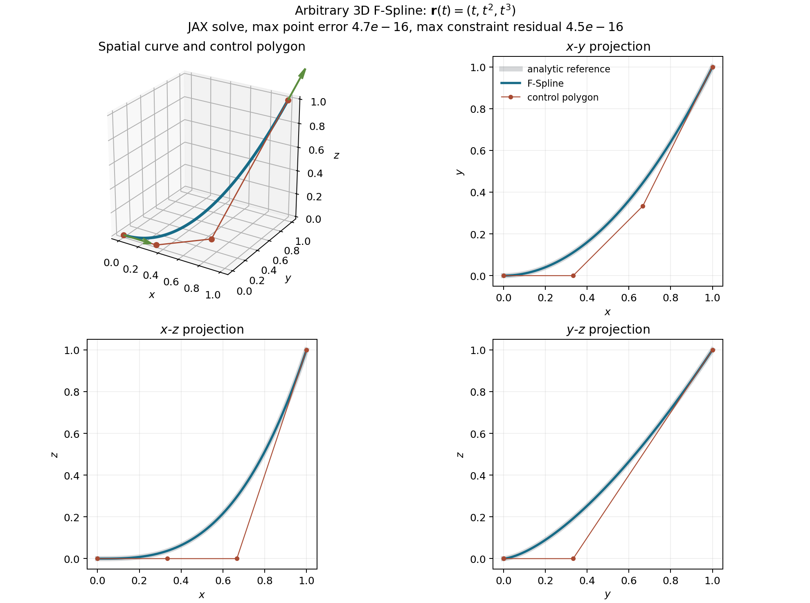
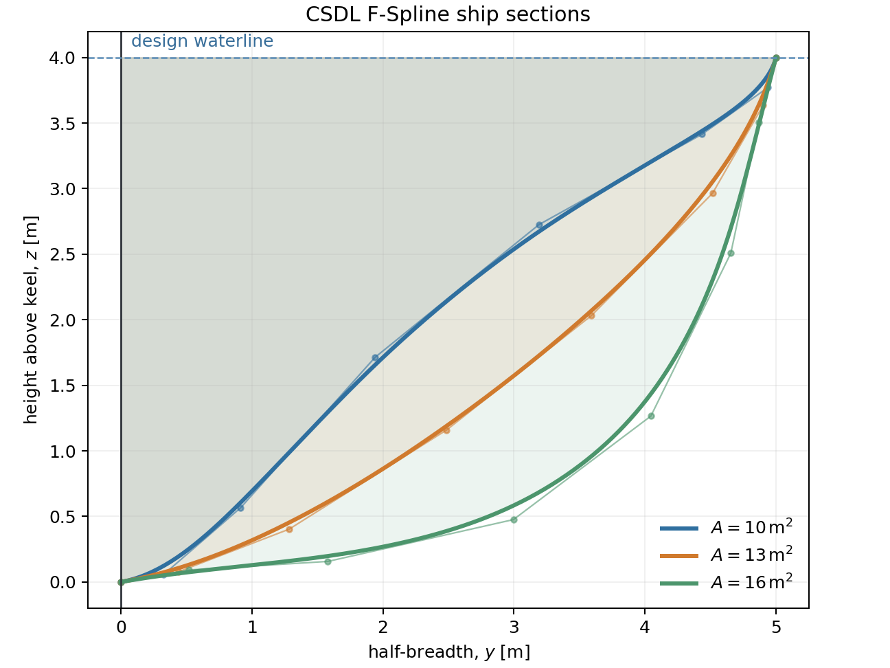

# F-Spline kernel

An F-Spline is a B-spline whose coefficients are found from a fairing problem,
rather than supplied directly. In any physical dimension $d$,

$$
\mathbf r(t)=\sum_{i=0}^{n-1}N_{i,p}(t)\mathbf P_i,\qquad 0\le t\le 1,
$$

`lsdo_function_spaces.BSplineSpace` owns the spline representation and
`lsdo_b_splines_cython` evaluates its sparse basis matrices. `ship_geo` adds
the variational problem

$$
\min_{\mathbf P}\ J(\mathbf P)
=\sum_k \alpha_k\int_0^1
\left\lVert\mathbf r^{(k)}(t)\right\rVert^2\,dt,
\qquad
\mathbf g(\mathbf P,\mathbf q)=\mathbf 0,
$$

where $\mathbf P_i\in\mathbb R^d$ and $\mathbf q$ contains form parameters such
as endpoints, tangent directions,
area, and centroid. Composite Gauss-Legendre quadrature turns each fairness
integral into CSDL operations.

The implementation forms the Lagrangian

$$
\mathcal L(\mathbf P,\boldsymbol\lambda;\mathbf q)
=J(\mathbf P)+\boldsymbol\lambda^T\mathbf g(\mathbf P,\mathbf q)
$$

and solves its KKT residual with `csdl_alpha.nonlinear_solvers.Newton`:

$$
\mathbf F=
\begin{bmatrix}
\nabla_{\mathbf P}\mathcal L\\
\mathbf g
\end{bmatrix}
=\mathbf 0.
$$

Because the state and residual are CSDL variables, downstream quantities can
differentiate through the implicit solution. No ship-specific SciPy solve or
duplicate B-spline basis implementation is used.

## Implemented form constraints

| Constraint | Residual |
|---|---|
| Point | $\mathbf r(t_i)-\mathbf q_i$ |
| Derivative | $\mathbf r^{(k)}(t_i)-\mathbf q_i$ |
| Tangent angle | $y'\cos\theta-x'\sin\theta$ |
| Spatial tangent direction | $r'_j d_p-r'_p d_j$, $j\ne p$ |
| Curvature | $\kappa(t_i)-\kappa_i$ |
| Spatial curvature magnitude | $\lVert\mathbf r'\times\mathbf r''\rVert/\lVert\mathbf r'\rVert^3-\kappa_i$ in 3D, evaluated by an equivalent dimension-independent projection |
| Signed area | $A(\mathbf r)-A_i$ |
| Area centroid | $\bar{\mathbf r}(\mathbf r)-\bar{\mathbf r}_i$ |

Point, complete derivative, tangent-direction, fairness, arc-length, and
curvature-magnitude operations are dimension-independent. Tangent angle,
signed curvature, signed area, and area centroid are intentionally planar
because their signs and reference plane must otherwise be specified.

For a direction $\mathbf d\in\mathbb R^d$, the implementation selects one
nonzero pivot component $d_p$ and imposes $d-1$ independent equations

$$
r'_j(t)d_p-r'_p(t)d_j=0,\qquad j\ne p.
$$

This constrains direction without unnecessarily prescribing tangent speed. The
unsigned curvature is evaluated in any dimension using

$$
\kappa=
\frac{\left\lVert\mathbf r''-
(\mathbf r'\cdot\mathbf r'')\mathbf r'/\lVert\mathbf r'\rVert^2
\right\rVert}{\lVert\mathbf r'\rVert^2}.
$$

The following JAX-backed solve recovers the nonplanar cubic
$\mathbf r(t)=(t,t^2,t^3)$ from spatial endpoint and derivative constraints.
The three projections verify that all coordinates vary and that the curve is
not confined to a transverse section plane.

The first milestone uses open, non-rational curves. The current upstream
Cython backend safely exposes basis derivatives through order two, which is
sufficient for bending-energy fairing and curvature constraints.

