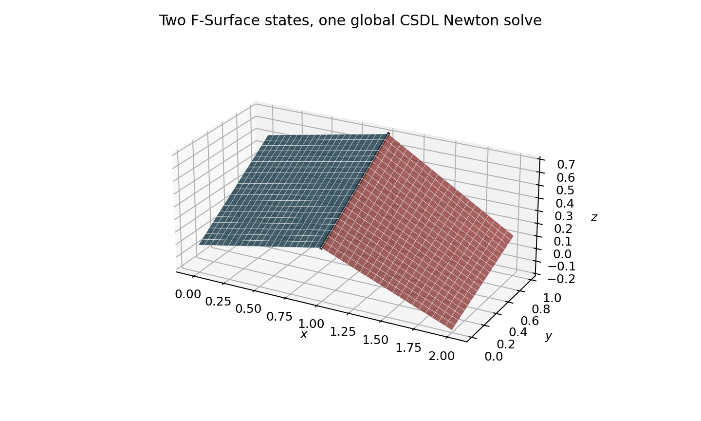
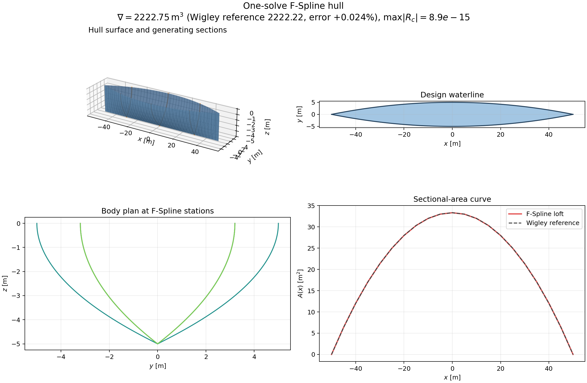

# First-principles hull geometry

`ship_geo` now assembles longitudinal curves of form, compatible transverse
F-Spline sections, and a tensor-product B-spline hull surface. The geometry is
created from form constraints rather than by deforming an imported parent
hull.

## One global variational solve

Each curve or section contributes an implicit coefficient state, a fairness
term, and equality constraints to `VariationalSystem`. Cross-curve continuity
and surface-fairness terms may be added before calling `solve()`. The system
forms one Lagrangian,

$$
\mathcal L(\mathbf z,\boldsymbol\lambda;\mathbf q)
=\sum_a J_a(\mathbf z_a)
+J_S(\mathbf z)
+\boldsymbol\lambda^T\mathbf g(\mathbf z,\mathbf q),
$$

and one global KKT residual,

$$
\mathbf R=
\begin{bmatrix}
\nabla_{\mathbf z}\mathcal L\\
\mathbf g
\end{bmatrix}
=\mathbf 0.
$$

`csdl_alpha.Newton` is invoked once. The compatible loft is a fixed CSDL
linear map from the solved transverse control polygons to the surface control
net, so it creates no nested nonlinear solve.

### KKT sparsity and where the solve cost actually goes

The assembled KKT matrix is strongly sparse and bordered block-diagonal.
Transverse sections never couple to one another; each couples only to its own
multipliers and to the handful of shared longitudinal curves that supply its
draft, half-breadth, area, and tangent targets. A measured three-station
form-parameter hull gives a $105\times105$ KKT matrix with 1032 structural
nonzeros, a density of $0.094$.

That sparsity is nonetheless **not** where a speed-up is available. The Newton
step is a dense `numpy.linalg.solve`, but at these dimensions the factorization
is microseconds. Timing the same case at one and three iterations separates a
fixed graph-construction cost of roughly $21\ \mathrm{s}$ from roughly
$14\ \mathrm{s}$ per Newton iteration; the per-iteration cost is CSDL
interpreting the derivative graph operation-by-operation in Python, and it
scales with graph size rather than with matrix bandwidth. Switching
`csdl.derivative` from its looped accumulation to the batched form
(`loop=False`) changed the total by under $2\%$.

The lever that would matter is eliminating per-operation Python overhead
entirely by JIT-compiling the graph through the `csdl_alpha` JAX backend.
That path is currently blocked for this package: `ship_geo` reads `.value`
during graph construction -- for constraint-target validation, for
initial-guess interpolation, and for the least-squares section
initialization -- and those values only exist under an `inline=True` recorder.
Making the ship layer JAX-ready means deferring every construction-time
`.value` read, which is a separate piece of work from the geometry itself.

`FSurfaceProblem` adds a free tensor-product surface control net when lofted
section coefficients alone are not sufficiently general. Its primary
`assemble(system)` interface contributes the control net, surface-fairness
energy, point or derivative constraints, and exact control-point constraints
without calling Newton. Several curves and surfaces can therefore share the
same `VariationalSystem.solve()` call. The standalone `FSurfaceProblem.solve()`
method is only a convenience wrapper around that assembly path.

The default thin-plate objective is

$$
J_S=\int_0^1\int_0^1
\left(
\lVert\mathbf S_{uu}\rVert^2
+2\lVert\mathbf S_{uv}\rVert^2
+\lVert\mathbf S_{vv}\rVert^2
\right)\,du\,dv.
$$

The coupled demonstration below contains two independent implicit surface
control nets and an exact cubic shared edge. Both states and the continuity
constraints converge in one global Newton iteration.

`SectionLoftProblem` exposes both surface formulations through the same public
builder:

- `surface_formulation="compatible_loft"` applies the fixed CSDL lofting map
  and introduces no independent surface state.
- `surface_formulation="variational"` registers an `FSurfaceProblem` in the
  section system. At every generating station, the surface is constrained at
  the transverse Greville abscissae. Because the surface and sections share
  the transverse degree and knot vector, these constraints enforce equality
  of the complete B-spline sections, not only the sampled points.

The variational mode therefore has one state per F-Spline section and one
surface-control-net state, but still invokes `VariationalSystem.solve()` only
once. `SectionLoftProblem.assemble(system)` also lets that complete group be
combined with other hull components before the global solve.

## Constants and differentiable variables

Whether a quantity belongs in the CSDL graph depends on whether a legitimate
design derivative passes through it.

| Quantity | Representation | Reason |
|---|---|---|
| Gauss nodes and weights | NumPy constant | Fixed numerical integration rule |
| Knot vectors, degree, topology | NumPy/Python constant | Fixed discretization during one optimization |
| Evaluation parameters | NumPy constant | Fixed sampling locations |
| Principal dimensions | CSDL variable/expression | Design inputs |
| Section area, breadth, draft | CSDL variable/expression | Form parameters and curve outputs |
| Tangent, curvature, centroid targets | CSDL variable when design-dependent | Preserve implicit design derivatives |
| Curve and surface coefficients | CSDL implicit or explicit variables | Geometry states and outputs |
| Hydrostatic quantities | CSDL variables | Differentiable analysis outputs |

Quadrature data should only become design-dependent if the integration domain,
knot locations, or quadrature rule itself is optimized. That is intentionally
outside the fixed-topology formulation.

## Coordinate convention

A transverse half section stores `(z, y)` and runs from keel to waterline. Its
signed area is therefore

$$
A_{1/2}=\int_{-T}^{0} y(z)\,dz.
$$

The starboard hull surface stores `(x, y, z)`, with `u` increasing from keel to
waterline and `v` increasing from bow to stern. Compatible section control
polygons are fitted longitudinally to form

$$
\mathbf S(u,v)=
\sum_i\sum_j N_{i,p}(u)M_{j,q}(v)\mathbf P_{ij}.
$$

Pointed bow and stern sections are explicit collapsed centerplane curves
derived from the nearest interior section. Hard chines use an interior knot of
multiplicity equal to the spline degree, producing a $C^0$ join.

## Naval form-parameter hierarchy

`FormParameterHullProblem` implements the MIT-style separation between primary
naval-architecture particulars and auxiliary local shape controls. The primary
input set is

$$
L_{PP},\quad B,\quad T,\quad \nabla,\quad x_{LCB},\quad C_{WP}.
$$

These quantities constrain the sectional-area, design-waterline, and draft
curves exactly. For example, with $v\in[0,1]$ and $x=L_{PP}(v-1/2)$,

$$
2L_{PP}\int_0^1 A_{1/2}(v)\,dv=\nabla,
$$

$$
L_{PP}\left(
\frac{\int_0^1vA_{1/2}(v)\,dv}
{\int_0^1A_{1/2}(v)\,dv}-\frac12
\right)=x_{LCB},
$$

and

$$
\frac{2}{B}\int_0^1 b_{WL}(v)\,dv=C_{WP}.
$$

Sampled half-breadth, section-area, draft, deadrise, and flare distributions
are auxiliary targets. Their squared mismatch selects among curves satisfying
the primary constraints, while an integrated curvature term prevents the
auxiliary fit from introducing oscillatory geometry. These targets may be CSDL
variables and therefore remain differentiable design controls.

The form curves and every transverse F-Spline section are assembled into one
`VariationalSystem`. A transom-ended hull can use a collapsed bow with an
uncollapsed stern by setting `pointed_ends=(True, False)`.

The regression case recovers all six primary inputs to solver tolerance and
verifies $dB_{recovered}/dB=1$. The next DTMB 5415 stage will extract these
primary values from the canonical geometry, fit only the auxiliary
distributions, and measure both form-parameter and final-surface residuals.

## Hydrostatics

For a symmetric starboard half surface with outward area vector
$\mathbf n\,dA=\mathbf S_u\times\mathbf S_v\,du\,dv$, volume is evaluated as

$$
\nabla=2\int_S y n_y\,dA.
$$

The implementation also computes LCB, VCB, waterplane area, LCF, transverse
and longitudinal waterplane moments of inertia, sectional areas, and wetted
surface area. The exact quadratic Wigley representation verifies

$$
\nabla=\frac{4}{9}LBT,
\qquad
z_B=-\frac{3}{8}T,
\qquad
A_{WP}=\frac{2}{3}LB.
$$

For a general closed patch collection, every patch carries an outward normal
sign and explicit `wetted` and `waterplane` roles. Volume and first moments use
the full divergence-theorem identities

$$
\nabla=\frac{1}{3}\int_{\partial V}\mathbf r\mathbin{\cdot}\mathbf n\,dA,
\qquad
\int_V x_i\,dV=\frac{1}{2}\int_{\partial V}x_i^2 n_i\,dA.
$$

`ClosedSurface.from_symmetric_starboard()` mirrors a starboard hull and can
construct exact waterplane and transom caps directly from compatible boundary
control rows. Analytic box and prismatic-transom tests verify orientation,
volume, centroids, waterplane inertias, wetted area, and CSDL derivatives.

## Approximation, topology, and validity

`refine_curve()` and `refine_surface()` perform exact nested-space knot
insertion through differentiable linear maps. `fit_offset_surface()` provides
a CSDL linear least-squares inverse fit for validation against offset tables.
The fixed patch topology is recorded by `PatchGraph`, which can add sampled
positional and tangent-continuity constraints to the same global variational
system.

`evaluate_surface_validity()` exposes sampled half-breadths, surface Jacobian
magnitudes, coordinate monotonicity, centerplane gaps, and waterline errors as
CSDL arrays. They may be used directly as optimizer constraints or inspected
numerically through `SurfaceValidity.report()`.

`evaluate_closed_surface_closure()` matches sampled patch boundaries in either
direction. `section_self_intersections()` detects crossings in transverse
polylines, while residual span indicators identify knot intervals that need
refinement. Structured CSDL meshes preserve derivatives at their vertices;
their current numerical state can be seam-welded for watertightness checks and
exported to STL or OBJ as a terminal, non-differentiable operation.

The first published validation hull is DTMB 5415. Its sonar dome is represented
as a separate connected region and receives its own approximation-error and
refinement report, rather than being smoothed into the main forebody. The fine
model reaches a global RMS surface error of $0.350\ \mathrm{mm}$ and a sonar
dome RMS error of $0.233\ \mathrm{mm}$ on the $6.119\ \mathrm{m}$ reference
model.

