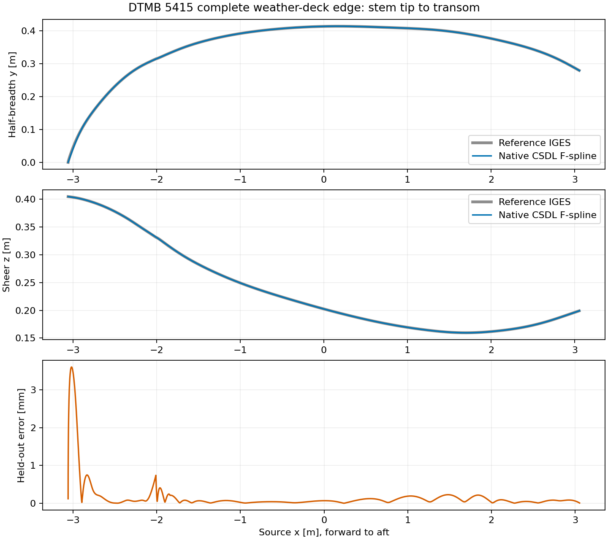

# Whole-weather-deck F-spline calibration

This stage fits the complete DTMB 5415 deck edge, including the raked stem
forward of FP. It reuses `FormCurveProblem`, `VariationalSystem`, and the pinned
`lsdo_function_spaces` backend. It introduces no new solver or curve hierarchy.

## Coordinates and solve

Let $x_f$ and $x_a$ be the actual deck-tip and transom coordinates. Define

$$
u=(x-x_f)/L_D,\qquad L_D=x_a-x_f,\qquad
D(u)=(x_f+L_Du,\ L_Db(u),\ L_Dh(u)).
$$

The deck coordinate is **not** the underwater FP-to-AP station coordinate.
The reference uses metres, positive x aft, and z=0 at the design waterplane.
Do not add the draft to the reference heights without also changing the hull
datum. The sampled source deck spans x=-3.0595482 to 3.0595490 m.

Each scalar curve has 24 cubic coefficients, with simple interior knots
distributed among the forward, shoulder, middle, and aft regions separated
at u=0.12, 0.25, and 0.8. These are resolution allocations, not disconnected
curves. Simple cubic knots ensure C2 throughout each side's complete edge.
Because $D'_x=L_D>0$, the space curve is regular. This does not require a
rounded port-to-starboard stem or rounded transom corners.

Both curves contribute to the caller's single KKT/Newton system:

$$
\min_{c_b,c_h}\sum_{q\in\{b,h\}}\left[
\frac1N\sum_k(q(u_k)-q_k)^2+
10^{-8}\int_0^1(q''(u))^2\,du\right],
\quad q(0)=q_0,\quad q(1)=q_1.
$$

No zero sheer slope is imposed at midship or aft. These were unjustified
restrictions for this reference. Sampling is equal per source face, so the
objective intentionally gives more weight per unit length to the short
forward faces. The reported RMS uses the same face-weighted convention.
The second-derivative term is a parametric fairness penalty, not exact
geometric bending energy. Positivity is currently checked on a dense grid,
not enforced globally by this equality-constrained fit.

## Exact application to a topside

With coefficients expressed in common clamped spaces, `apply_deck_edge`
implements

$$
\widetilde S(u,v)=S(u,v)+g(v)[D(u)-S(u,1)],\qquad
g(v)=10v^3-15v^4+6v^5.
$$

Here v=0 is the retained waterline and v=1 the deck. The quintic Bezier
coefficients of g are [0,0,0,1,1,1]. This sets the deck exactly and leaves
the waterline position, first derivative, and second derivative unchanged.
It also leaves the existing transverse first and second derivatives at the
deck unchanged; a deck-angle metasurface remains a separate section control.

Apply the deck operation first, then `integrate_stem`, with the stem's upper
endpoint equal to D(0). The stem correction must retain the waterline two-jet.
Tests verify that this compatible composition preserves both prescribed
boundaries without a Coons patch. Space conversion and full model wiring
are still required before applying this operation to the existing loft.
In particular, its underwater station parameter cannot simply be relabeled
as the whole-deck coordinate. A common parameterization must account for
the forward overhang.

## Reproduction and current scope

```bash
python -m pytest tests/test_deck_edge.py tests/test_stem_integration.py -q
python examples/dtmb_5415_whole_deck.py --source /path/to/goteborg_original.iges
```

The example validates the SHA256 already pinned by the repository's DTMB
reference loader. It uses 603 training points and 1200 independently offset
validation points on the exact IGES boundaries. At 24 coefficients per curve:

| Check | Result |
| --- | ---: |
| Held-out edge RMS | 0.7003 mm |
| Held-out maximum | 3.6047 mm |
| Maximum equality residual | 0 |
| Maximum stationarity residual | 3.38e-18 |

The largest error is near the stem tip. Reference face seams are not welded
or silently removed. Error is the Euclidean ordinate difference at the same
physical x, not a closest-point distance. JSON output contains the knots,
normalized coefficients, coordinate mapping, and diagnostics for reuse.



This is a complete **edge calibration and boundary-operation milestone**,
not a calibrated whole topside or sonar dome. The next integration step is
common-space surface assembly, followed by a fit of the dome's own forward
extent and vertical profile. Dome projection remains independent of the
weather-deck overhang and must be measured from its specified local stem
datum, not inferred from the deck tip.
